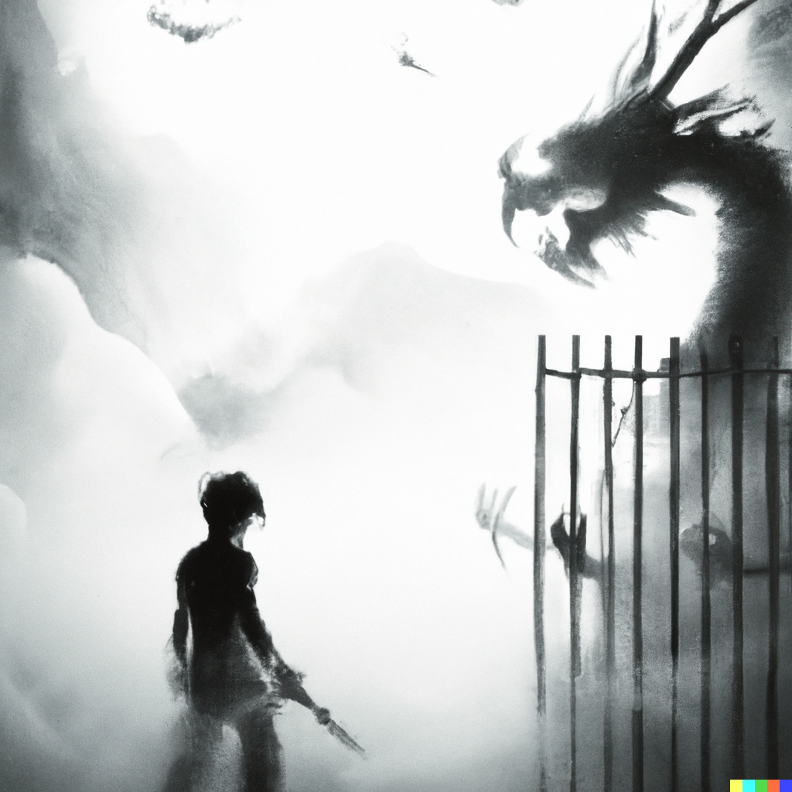

# OpenCV-Stickman



> It is a common tale from the twenty-first century...
> Virtual worlds remain as distant as ever, while their need keeps on increasing.
> Here is something that doesn't fulfill that promise, but provides, at least to its creators,
> a small part of the pleasure promised by full virtual reality.

Ever wanted to play a VR like game without VR?  
or tired of playing the same old type of games?  
How about doing exercise while playing games?  

TheAiPeople bring you a stickman based game where you can play the game using your whole body.  

## First run
```bash
git clone https://github.com/yashasnadigsyn/Opencv-Stickman/tree/main
cd Opencv-Stickman
python -m venv venv
source venv/bin/activate
pip install -r requirements.txt
python app2.py
```

**NOTE: If you're using another shell like `fish`, please run the apprpriate activation script from `venv/bin` in step 4.**

To play the game any time after the first run, just go into the game directory and run the following commands:
```bash
source venv/bin/activate
python app2.py
```

## Instructions
You just need to avoid the demons and hit them with the swords. There aren't any menus or controls (for now at least). There's just one:  
pressing the **Q** key force-exits the game. (doesn't work during the initial story)

## Credits
- Background Track "The Black Waltz" by Scott Buckley
- [Fantastical Dragon Image by **liuzishan** on Freepik](https://www.freepik.com/free-photo/fantastic-illustration-ancient-chinese-themes_14541139.htm#query=monster&position=25&from_view=search&track=sph)
- Cover image used in README generated by [s-m33r](https://github.com/s-m33r) using DALL-E 2
